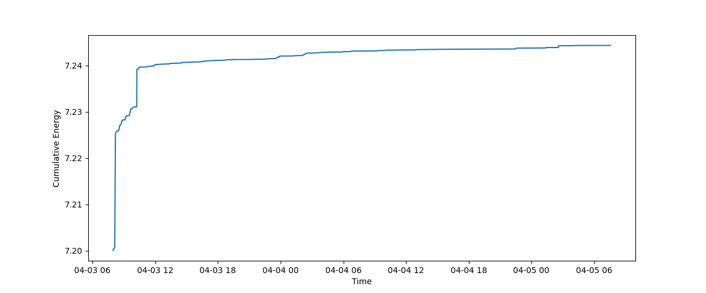

# 0403-Earthquake

Data for the 0403 earthquake that happened on 04/03/2024 in Taiwan.

## Visualizations

Earthquake magnitudes (ML) over time (red: ML >= 5.5, green: 4 <= ML < 5.5, blue: ML < 4):

Earthquake frequency (running average over 4 hours):

Earthquake cumulative energy (ML equivalent):

Spatial distribution of the epicenters:

