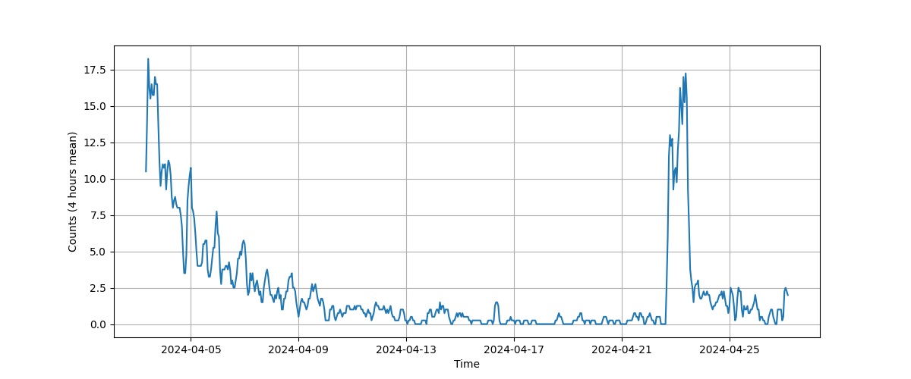
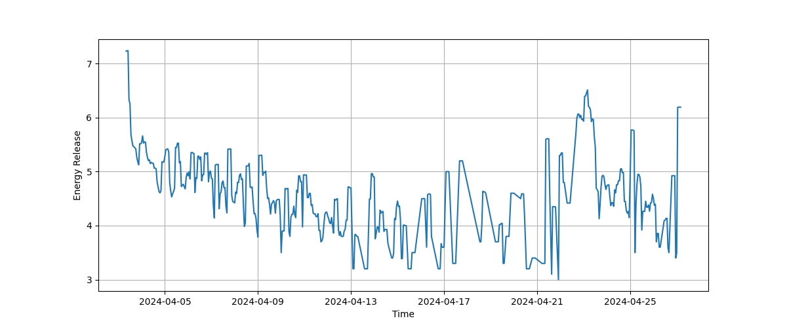
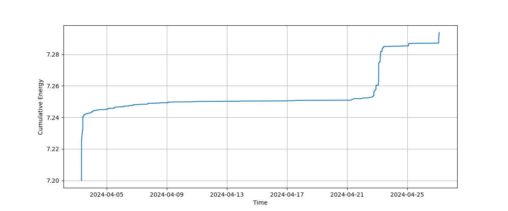

# 0403花蓮地震 / 0403-Earthquake

0403花蓮地震相關資料與作圖；Data for the 0403 earthquake that happened on 04/03/2024 in Taiwan.

## 資料作圖 / Visualizations

芮氏地震規模與發生時間 (紅: 規模 >= 5，綠: 4 <= 規模 < 5，藍: 規模 < 4)；Earthquake magnitudes (ML) over time (red: ML >= 5, green: 4 <= ML < 5, blue: ML < 4):

地震發生頻率 (4小時移動平均)；Earthquake frequency (running average over 4 hours):

地震序列當下釋放能量 (芮氏規模相當，4小時累積)；Earthquake series energy release (ML equivalent, running average over 4 hours):

地震序列累積釋放能量 (芮氏規模相當)；Earthquake series cumulative energy (ML equivalent):

震央空間分布；Spatial distribution of the epicenters:

